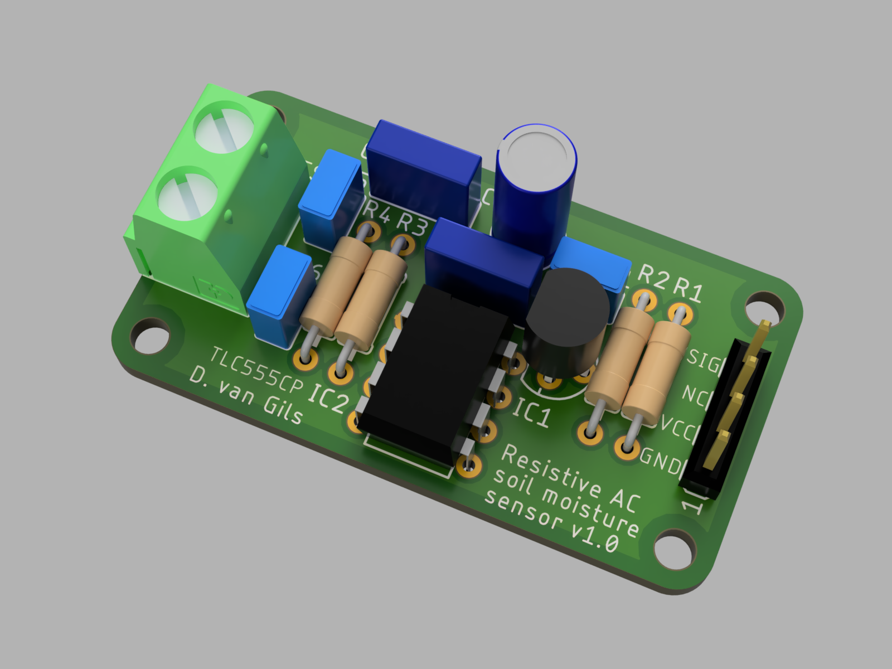
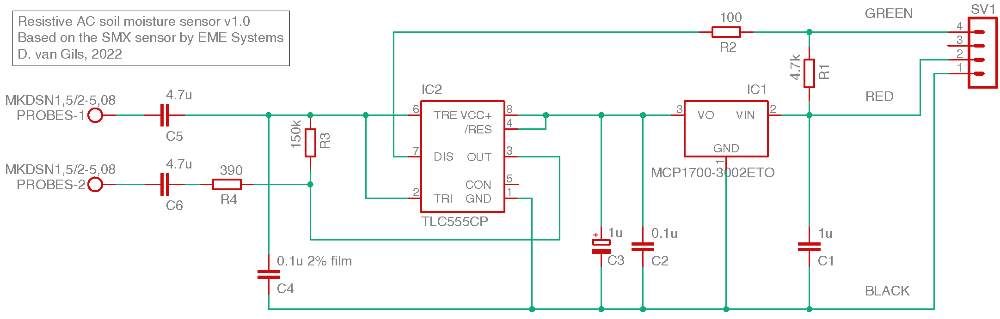
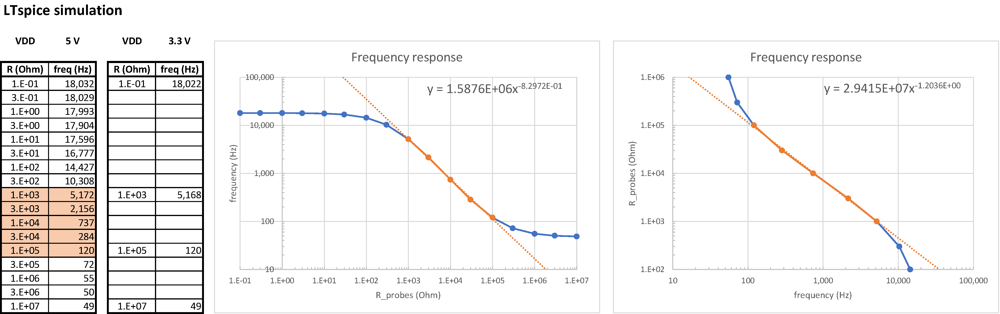

.. image:: https://img.shields.io/badge/License-MIT-purple.svg
    :target: https://github.com/Dennis-van-Gils/PCB-resistive-AC-soil-moisture-sensor/blob/master/LICENSE.txt

Resistive AC soil moisture sensor
=================================

This project involves a printed circuit board design to measure the resistance
between two metallic probes that can be placed inside soil as a measure of the
soil humidity. It uses AC current to sense the resistance between the probes,
preventing corrosion of the probes which otherwise would be the case when a DC
current would be used instead. The design is based on the
`SMX sensor <https://www.emesystems.com/smx/main.html>`__ by EME Systems.

The sensor works on both 3.3 V and 5.0 V supply voltage. The output is a pulse
train with an amplitude equal to the supply voltage and of a variable frequency
that correlates to the measured resistance. The pulses are at a 50% duty cycle.

Contains EAGLE CAD, Fusion360 and LTSpice simulation files.

- Github: https://github.com/Dennis-van-Gils/PCB-resistive-AC-soil-moisture-sensor

PCB design
==========

The PCB production Gerber files can be found `here. <EAGLE/AC_soil_sensor_v1.0_2022-05-01.zip>`__

.. include:: EAGLE/BOM.txt
   :literal:

LTspice simulation
==================

The frequency-resistance relationship of the simulated idealized circuit:

Dennis van Gils, 2022